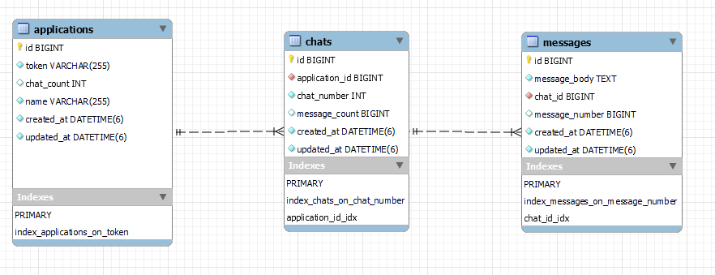

# Chatapp
* This project includes a chatting API built using Ruby on Rails.
* The app offers the ability to create different chat applications each containing different chats with each chat containing multiple messages, while keeping track of the number of chats per application and the number of messages per chat.

## Table of contents
1. [Demo](#Demo)
2. [Usage](#Usage)
    * 2.1 [Requirements](#Requirements)
    * 2.2 [How to Run](#How-to-Run)
    * 2.3 [Endpoints](#Endpoints)
3. [Under the hood](#Under-the-hood)
    * 3.1 [Schema](#Schema)
    * 3.2 [Services](#Services)

## Demo
https://github.com/ElNahrawy/chatapp/assets/87456471/e5a44c90-17cc-40a5-8706-fcdb97b2811c
## Usage:
### Requirements
* Docker (version used in development: 24.0.7)
* A tool to interact with the API e.g. curl or Postman
### How to Run:
```
git clone https://github.com/ElNahrawy/chatapp.git
cd chatapp
docker compose up
```
Once all services are up and running the app will be accessible through:
http://0.0.0.0:3000

#### **NB**
* If you're running this app on wsl, you may need to modify some config for the Elasticsearch service to work correctly.
Kindly refer to this [section](https://www.elastic.co/guide/en/elasticsearch/reference/current/docker.html#_windows_with_docker_desktop_wsl_2_backend) of needed modifications to wsl.
* If you have Mysql installed locally on your machine, a Mysql service may start automatically with the machine startup, preventing the app of binding to the default Mysql port.
This can be solved by stopping the Mysql service before running the app.
This can be done by running the following command in Windows
> net stop MySQL80

### Endpoints

After running the app successfully you can interact with these endpoints for all supported operations.

```
# Applications
# Get all applications
curl -X GET  http://0.0.0.0:3000/applications

# Get an application using its token
curl -X GET  http://0.0.0.0:3000/applications/[application token]

# Create a new application
curl -X POST -H "Content-Type: application/json" -d '{"name": [application name]}' http://0.0.0.0:3000/applications

# Update an existing application name using its token
curl -X PATCH -H "Content-Type: application/json" -d '{"name": [application name]}' http://0.0.0.0:3000/applications/[application token]

# Delete an application using its token
curl -X DELETE http://0.0.0.0:3000/applications/[application token]

# Chats
# Get all chats within an application using its token
curl -X GET http://0.0.0.0:3000/applications/[application_token]/chats

# Get a chat using its application token and chat_number
curl -X GET http://0.0.0.0:3000/applications/[application_token]/chats/[chat_number]

# Create a new chat in an application using its token
curl -X POST http://0.0.0.0:3000/applications/[application_token]/chats

# Delete a chat using its application token and chat_number
curl -X DELETE http://0.0.0.0:3000/applications/[application_token]/chats/[chat_number]

# Messages
# Get all messages in a chat using its application token and chat_number
curl -X GET http://0.0.0.0:3000/applications/[application_token]/chats/[chat_number]/messages

# Get a message using its application token, chat_number, message_number
curl -X GET http://0.0.0.0:3000/applications/[application_token]/chats/[chat_number]/messages/[message_number]

# Create a new message in chat using its application token and chat_number
curl -X POST -H "Content-Type: application/json" -d '{"message_body": [message content]}' http://0.0.0.0:3000/applications/[application_token]/chats/[chat_number]/messages

# Update an existing message body using its application token, chat_number and message_number
curl -X PATCH -H "Content-Type: application/json" -d '{"message_body": [message content]}' http://0.0.0.0:3000/applications/[application_token]/chats/[chat_number]/messages

# Delete an existing message body using its application token, chat_number and message_number
curl -X DELETE http://0.0.0.0:3000/applications/[application_token]/chats/[chat_number]/messages/[message_number]


```

## Under the hood
### Schema

### Services:
1. Mysql: it's utilized as the main datastore. Since the app may run on multiple servers, row level locks are implied to avoid race conditions.
To avoid excessive locking that would result in high latency, counters are stored at Redis and updated in Mysql database at fixed intervals.
NB: default counters update time is set to once each 10 second, this is for development purposes only. A longer interval should be used in production.
2. Redis: in memory data store, that is used for storing and frequent updating of counters along with Redlock gem to avoid race conditions while updating counters.
Also, it serves as a store for Sidekiq jobs.
3. Sidekiq: queuing system that is used for queuing operations on the database allowing for low response time while executing time consuming operations at the background.
Also used for scheduling the updates of the counters in the database.
4. Elasticsearch: Used for searching across messages.
